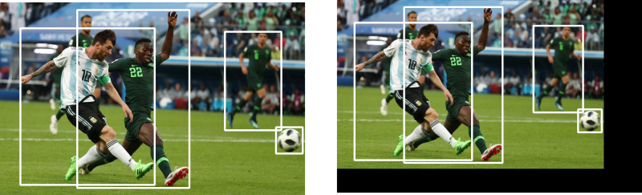
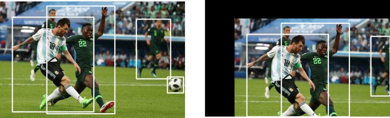
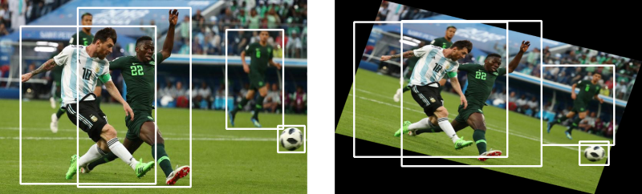
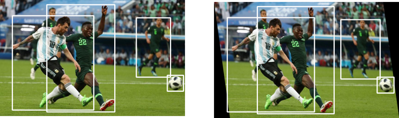
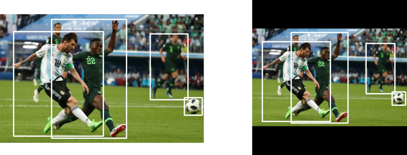

# Data Augmentation For Object Detection

Accompanying code for the [Paperspace tutorial series on adapting data augmentation methods for object detection tasks](https://blog.paperspace.com/data-augmentation-for-bounding-boxes/)

## Dependencies
1. OpenCV 3.x
2. Numpy
3. Matplotlib

We support a variety of data augmentations, like.

### Horizontal Flipping

### Scaling

### Translation

### Rotation

### Shearing

### Resizing

## Quick Start
A quick start tutorial can be found in the file `quick-start.ipynb` in this repo.

## Documentation
A list of all possible transforms and extensive documentation can be found in by opening `docs/build/html/index.html` in your browser or at this [link.](https://augmentationlib.paperspace.com/)
